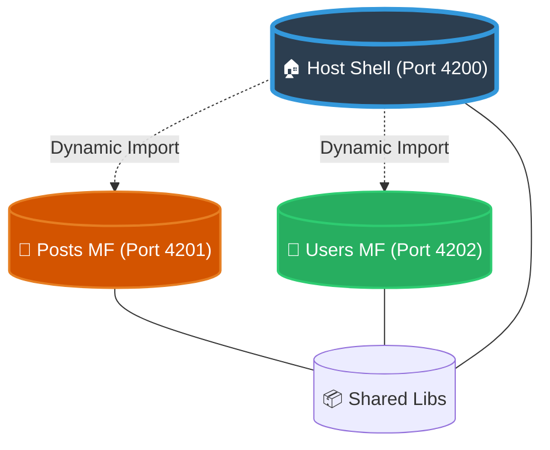

# 🌐 Multi-Hub: Advanced Microfrontend Workspace

[](https://nx.dev)
[](https://angular.io)
[](https://module-federation.io/)
[](LICENSE)

A state-of-the-art **Nx Monorepo** designed for high-performance, scalable microfrontend architectures. Multi-Hub leverages **Angular 21**, **Module Federation**, and **Tailwind CSS** to provide a seamless "Shell & Remotes" experience.

---

## 🏛 Architecture Overview

Multi-Hub uses a **Distributed Frontend Architecture** where a central "Host Shell" dynamically orchestrates multiple independent "Remotes" at runtime.



---

## ✨ Core Features

-   **⚡ Zero-Config Federation:** Automatic module federation setup using Nx plugins.
-   **🎨 Unified Styling:** Shared design system powered by Tailwind CSS.
-   **🚀 Concurrent Development:** Start all microfrontends with a single command.
-   **🛡 Type Safety:** Cross-application type definitions and interface sharing.
-   **📊 Smart Graph:** Automated dependency visualization via Nx Graph.

---

## 🛠 Tech Stack

| Category | Technology |
| :--- | :--- |
| **Monorepo** | [Nx 22.6.5](https://nx.dev) |
| **Host Framework** | [Angular 21.x](https://angular.io) |
| **Microfrontends** | [Module Federation v2](https://module-federation.io/) |
| **Styling** | [Tailwind CSS](https://tailwindcss.com) |
| **Bundlers** | Webpack & Vite |
| **Testing** | Vitest & Playwright |

---

## 📂 Project Structure

```text
multi-hub/
├── apps/
│   ├── host-shell/         # 🏠 Main orchestrator application
│   └── host-shell-e2e/     # 🧪 End-to-end tests for the host
├── posts_mf/               # 📝 Posts Microfrontend (Remote)
├── users_mf/               # 👥 Users Microfrontend (Remote)
├── libs/                   # 📦 Shared libraries & components (Coming soon)
└── nx.json                 # ⚙️ Nx workspace configuration
```

---

## 🏁 Getting Started

### 1. Installation

```bash
npm install
```

### 2. Running the Workspace

| Task | Command | Description |
| :--- | :--- | :--- |
| **Serve All** | `npm run serve:all` | **(Recommended)** Starts Host and all Remotes concurrently |
| **Serve Host** | `npm run start` | Starts only the Host Shell |
| **Serve Posts**| `npx nx serve posts_mf` | Starts only the Posts Remote |
| **Serve Users**| `npx nx serve users_mf` | Starts only the Users Remote |

### 3. Port Mapping

| Application | Port | Endpoint |
| :--- | :--- | :--- |
| **Host Shell** | `4200` | `http://localhost:4200` |
| **Posts MF** | `4201` | `http://localhost:4201` |
| **Users MF** | `4202` | `http://localhost:4202` |

---

## 🧩 Developer Guide

### Adding a New Remote

To add a new Angular remote to the `host-shell`:

```bash
npx nx g @nx/angular:remote <name> --host=host-shell
```

### Visualizing the Graph

To see how your microfrontends are interconnected:

```bash
npm run graph
```

---

> [!TIP]
> Use `npm run serve:all` during development to ensure all federated modules are available to the host shell.

Created with ❤️ by the Multi-Hub Team.
